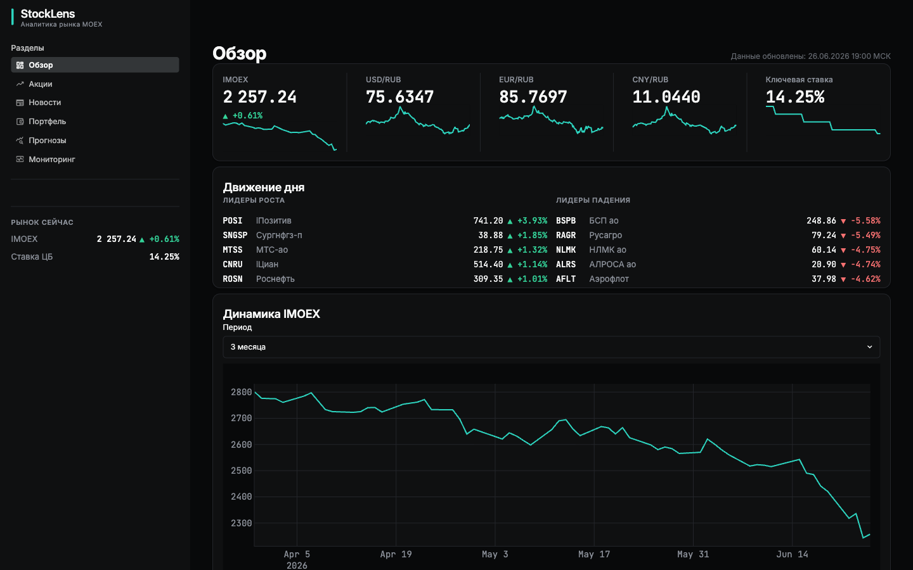
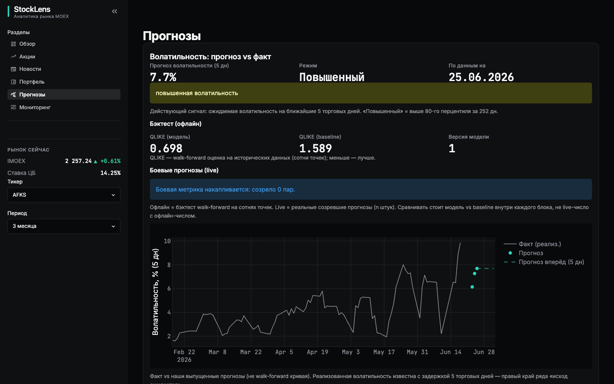
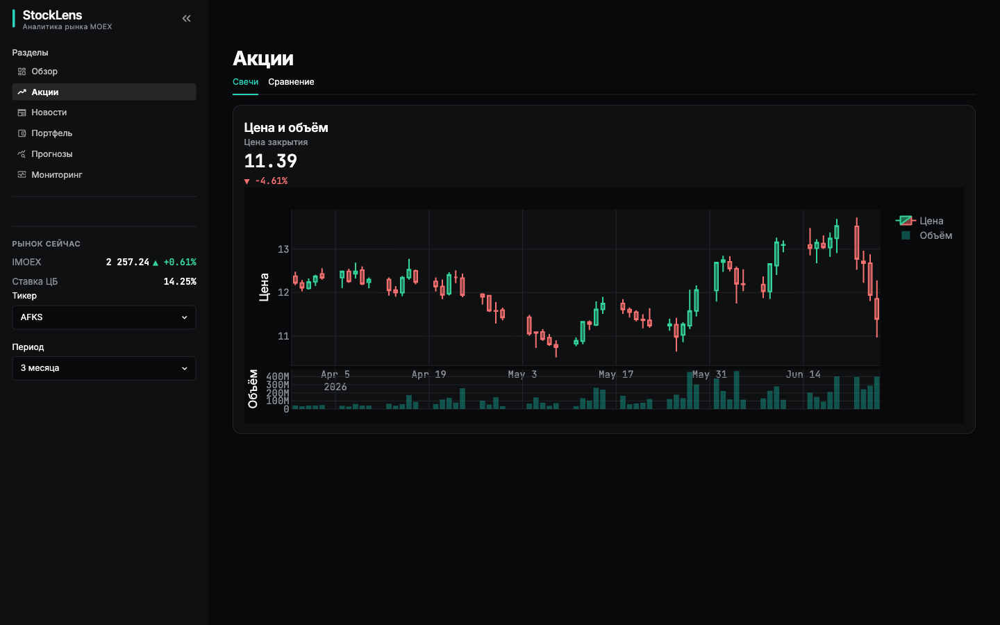
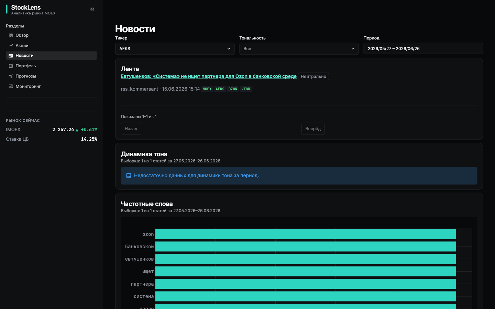
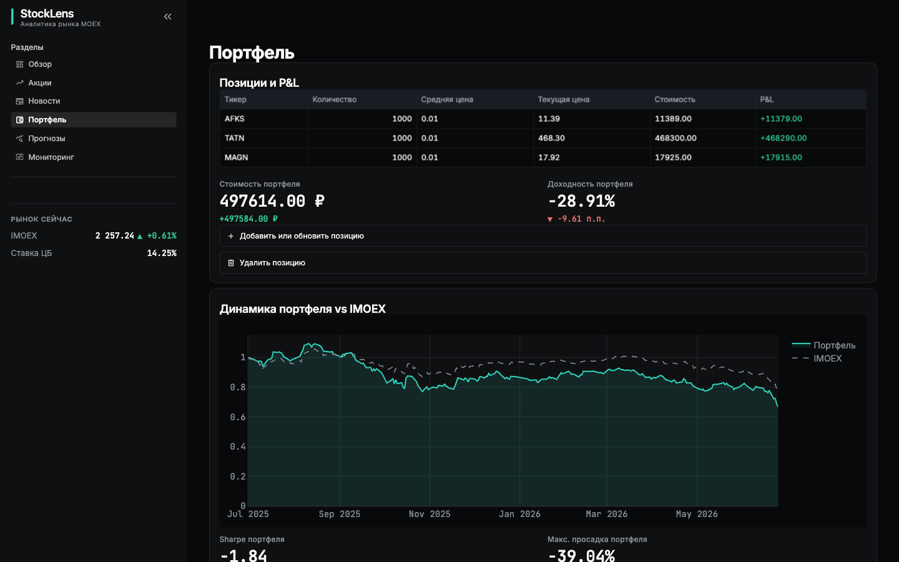

<div align="center">

# 📈 StockLens

**Персональный аналитический сервис по российскому фондовому рынку (MOEX)**

Ежедневный сбор котировок и новостей → детерминированная аналитика и честные ML-прогнозы
→ Streamlit-дашборд + Telegram-алерты.

[](https://www.python.org/)
[](https://fastapi.tiangolo.com/)
[](https://www.postgresql.org/)
[](https://redis.io/)
[](https://streamlit.io/)
[](https://mlflow.org/)
[](https://www.docker.com/)
[](https://docs.astral.sh/ruff/)
[](https://mypy-lang.org/)

</div>



---

## Что это

StockLens собирает дневные котировки ~45 бумаг индекса IMOEX, дивиденды, курсы ЦБ и
финансовые новости, считает по ним детерминированную аналитику и **честные ML-прогнозы**
(волатильность и вероятность направления — без обещаний «угадать цену»), и подаёт результат
через веб-дашборд и Telegram-бота.

Проект выполняет двойную роль: семестровый проект курса «Python & Data Science»
(production-grade стандарт, эталонная слоистая архитектура) **и** реальный инструмент частного
инвестора — развёрнут на VPS и работает непрерывно.

## Возможности

- 📊 **Мониторинг рынка** — дневные свечи, дивиденды, сплиты, индекс IMOEX, курсы и ключевая
  ставка ЦБ. Источник — официальный MOEX ISS API (без ключа), вежливый клиент ≤1 req/сек.
- 📰 **Новости и sentiment** — RSS РБК / Коммерсантъ / Интерфакс, тональность каждой новости
  (модель `rubert-tiny`, локальный CPU-инференс при сборе).
- 🤖 **Честный ML** — прогноз **волатильности** (GARCH / HAR-RV против naive baseline,
  walk-forward) и вероятностная **классификация тренда** (CatBoost + SHAP). Точечный прогноз
  цены сознательно **не делается** — рынок близок к эффективному на коротком горизонте.
- 💼 **Портфель** — P&L против IMOEX, риск-метрики, оптимизация Марковица, бэктест.
- ✈️ **Telegram-бот** — утренний дайджест и алерты по бумагам портфеля.

## Скриншоты

| Прогнозы (волатильность vs факт, QLIKE) | Акции (свечи, индикаторы) |
|:---:|:---:|
|  |  |
| **Новости + sentiment** | **Портфель (P&L vs IMOEX)** |
|  |  |

> Страница «Прогнозы» показывает методологию прямо в UI: **QLIKE модели 0.698 против baseline
> 1.589** (walk-forward на сотнях точек, меньше — лучше) — модель волатильности честно бьёт
> «вчерашнюю реализованную дисперсию».

## Архитектура

Семь сервисов в Docker Compose; `dashboard` и `bot` не знают про БД — только HTTP к API.


Подробно (C4-диаграммы, ER, поток данных, инварианты, ML-методология) —
в [docs/architecture.md](docs/architecture.md).

| Сервис | Роль | Стек |
|--------|------|------|
| `ingestor` | Сбор по расписанию, backfill, sentiment | APScheduler · requests · SQLAlchemy (**sync**) |
| `api` | REST `/api/v1`, портфель, ML-инференс | FastAPI · asyncpg · uvicorn (**async**) |
| `dashboard` | UI: 6 страниц | Streamlit · Plotly |
| `bot` | Алерты + дайджест | aiogram · APScheduler |
| `db` · `redis` | Хранилище · кэш | PostgreSQL 16 · Redis 7 |
| `mlflow` | Реестр моделей + трекинг | MLflow · PostgreSQL-backend |

**Инварианты:** один write-путь (рыночные таблицы пишет только `ingestor`); общий код
(ORM-модели, `StrEnum`, настройки) — пакет `stocklens-core`; API слоистый
(`routers → services → repositories` + `schemas/core/ml`); время в БД — UTC, отображение —
Europe/Moscow.

## ML-методология (честно)

- **Валидация только walk-forward** (`TimeSeriesSplit`, gap=5); случайный K-fold запрещён.
  Скейлеры и фичи фитятся только на train-окне — защита от утечки через препроцессинг.
- **Каждая модель сравнивается с naive baseline**; в реестр попадает только то, что **бьёт
  baseline**. Волатильность — бьёт (QLIKE 0.698 < 1.589 RW-RV). Тренд (price-only) — **edge
  не нашёлся** (ROC-AUC ≈ 0.49, проверено на CatBoost / logreg / RandomForest), поэтому
  serving готов, но модель в прод **не активирована**. Отрицательный результат
  задокументирован — это и есть дисциплина baseline-гейта, не провал.
- **Реестр MLflow**, продвижение через алиасы (`production`); версия модели пишется в прогноз
  и видна в UI.

## Статус

Все 7 сервисов **развёрнуты на VPS** (Dokploy), дашборд работает непрерывно. ML-инференс
волатильности активен в проде. Backfill истории при старте; новости (RSS без архива)
собираются непрерывно. Trend-вертикаль — serving-готова, активация ждёт sentiment-фичи.

## Быстрый старт

```bash
cp .env.example .env             # задать DB_PASSWORD и прочие секреты
docker compose up -d --build     # db → migrations → ingestor → redis → mlflow → api
```

- API: `http://localhost:8000` — Swagger `/api/docs`, ReDoc `/api/redoc`, OpenAPI
  `/api/openapi.json`. Маршруты `/api/v1/{data,portfolio,watchlist,predict,bot,monitoring,health,auth}`.
- Дашборд: `http://localhost:8501` (вход по паролю владельца).
- При первом старте `ingestor` догоняет историю котировок (~46 бумаг IMOEX, ≤1 req/сек к
  MOEX ISS, порядка 25 минут) и работает по расписанию (свечи 23:55, RSS каждые 30 мин,
  дивиденды/сплиты 08:00, курсы ЦБ 13:00 — Europe/Moscow).

Тесты (нужен Docker для интеграционных):

```bash
uv run --project services/api pytest services/api/tests        # api (testcontainers PG+Redis)
uv run --project services/ingestor pytest services/ingestor/tests
uv run --project ml --extra train pytest ml/tests              # оффлайн ML
```

## Документация

- 🏛 [Архитектура](docs/architecture.md) — C4-диаграммы, ER, поток данных, инварианты, ML.
- 📐 [Дизайн-спека](docs/specs/2026-06-11-stocklens-design.md) — источник истины по системе.
- 🧠 [ML-спека](docs/specs/2026-06-23-stocklens-ml-spec.md) · [ML-primer](docs/specs/2026-06-23-stocklens-ml-primer.md) · [рунбук переобучения](ml/README.md).
- 🚀 [Рунбук деплоя](docs/deploy.md) · 🛠 [правила разработки](CLAUDE.md) · 🎫 [тикеты](docs/tickets/).
- Сервисы: [api](services/api/README.md) · [ingestor](services/ingestor/README.md) ·
  [dashboard](services/dashboard/README.md) · [bot](services/bot/README.md) ·
  [stocklens-core](packages/stocklens-core/README.md).

## Стек

Python 3.12 · uv · FastAPI + Pydantic v2 · SQLAlchemy 2.0 (async в api, sync в ingestor) ·
Alembic · PostgreSQL 16 · Redis 7 · APScheduler · aiogram · Streamlit + Plotly · MLflow ·
scikit-learn + CatBoost + `arch` (GARCH) + SHAP · rubert-tiny (sentiment) · structlog ·
pytest + testcontainers · ruff + mypy strict · Docker Compose · Dokploy (деплой).
