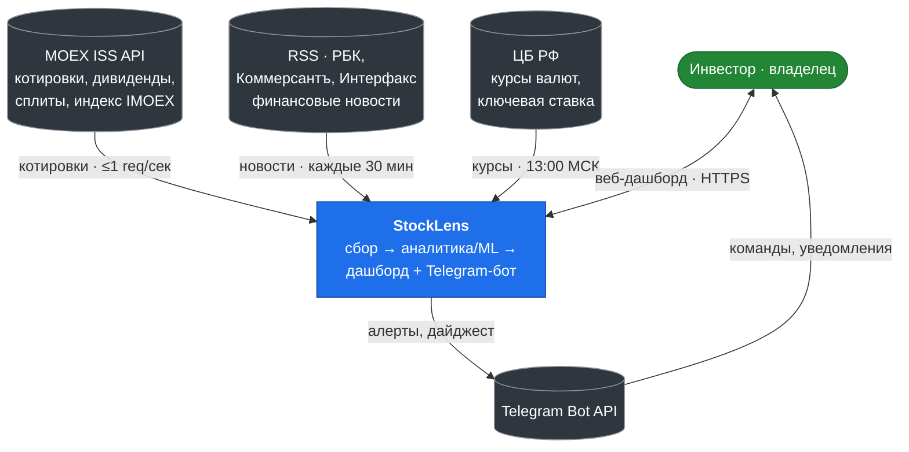
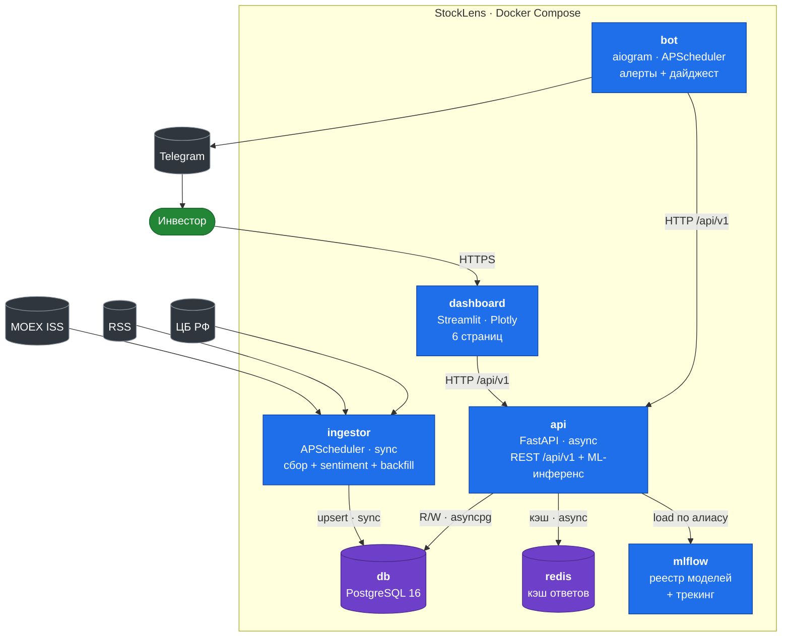
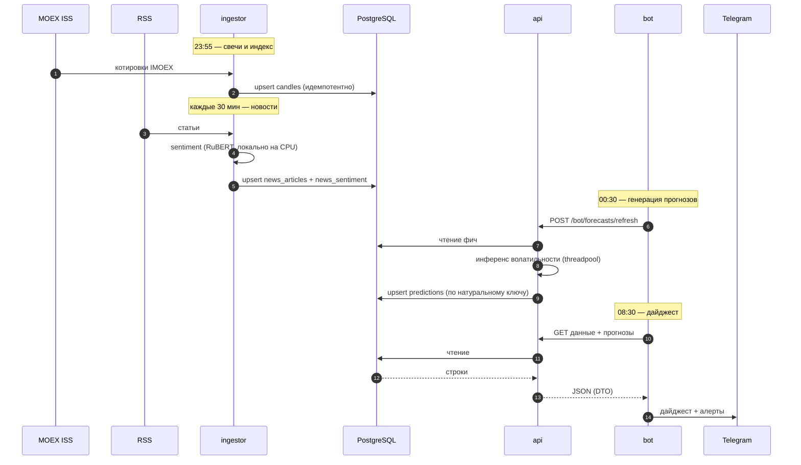
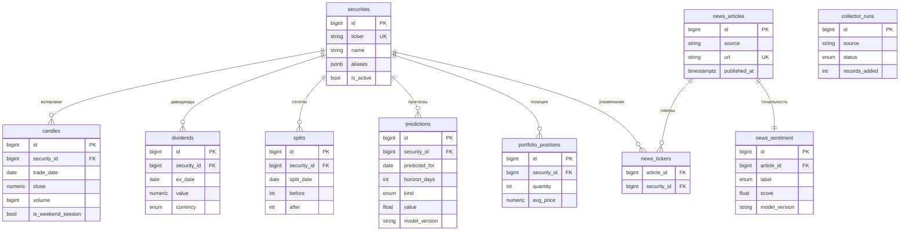
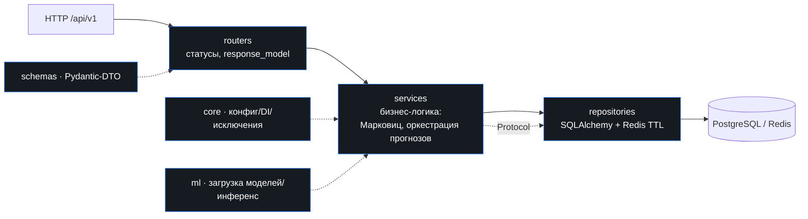

# Архитектура StockLens

Карта системы для онбординга и ревью. Диаграммы рендерятся прямо в GitHub (mermaid).
Единственный источник истины по дизайну — [спека](specs/2026-06-11-stocklens-design.md)
и [ML-спека](specs/2026-06-23-stocklens-ml-spec.md); этот документ — навигируемый обзор,
не замена спекам.

> **Что это.** Персональный аналитический сервис по российскому фондовому рынку:
> ежедневный сбор котировок MOEX и новостей → детерминированная аналитика и честные
> ML-прогнозы (волатильность, направление тренда) → Streamlit-дашборд + Telegram-алерты.

---

## 1. Контекст (C4 level 1)

Кто и что вокруг системы.

Система **однопользовательская** (владелец-инвестор), без мультитенантности. Все внешние
источники — официальные и бесключевые (MOEX ISS, RSS, ЦБ РФ). Новости архива не имеют —
прод-инстанс работает непрерывно, иначе пропуск невосстановим.

---

## 2. Контейнеры (C4 level 2)

Семь сервисов Docker Compose. Стрелки — направление вызова.

| Сервис | Ответственность | Стек | Режим |
|--------|-----------------|------|-------|
| **db** | Хранилище: котировки, новости, портфель, прогнозы | PostgreSQL 16 | — |
| **redis** | Кэш тяжёлых ответов API (свечи, оптимизация) | Redis 7, LRU | — |
| **ingestor** | Сбор по расписанию, backfill при старте, sentiment-скоринг | APScheduler · requests · SQLAlchemy | **sync** |
| **api** | REST `/api/v1`, портфель, ML-инференс волатильности/тренда | FastAPI · asyncpg · uvicorn | **async** |
| **dashboard** | UI: Обзор, Акции, Новости, Портфель, Прогнозы, Мониторинг | Streamlit · Plotly | — |
| **bot** | Telegram-алерты, утренний дайджест, подписки | aiogram · APScheduler | async |
| **mlflow** | Трекинг экспериментов, реестр моделей, артефакты | MLflow · PostgreSQL-backend | — |

---

## 3. Поток данных

Сквозной суточный цикл: сбор → sentiment → хранение → инференс → алерт. Время — Europe/Moscow.

Ключевое: **sentiment скорится в `ingestor`** при сборе (модель локальная, лёгкая) — API
отдаёт готовые оценки из БД. **ML-инференс** живёт только в `api` (модели грузятся из
реестра MLflow при старте, исполняются по запросу/триггеру бота).

---

## 4. Модель данных

15 таблиц, владелец схемы — пакет `stocklens-core` (ORM-модели, одна точка истины).

Плюс таблицы без связей на схеме: `index_values` (IMOEX), `currency_rates`, `key_rates`
(ЦБ РФ), `bot_subscriptions`, `watchlist`, `collector_runs` (журнал запусков сборщиков).

**Доменные `StrEnum`** (из `stocklens-core`, строковые литералы в логике запрещены):

| Enum | Значения |
|------|----------|
| `CollectorRunStatus` | `success` · `partial` · `failed` |
| `SentimentLabel` | `positive` · `neutral` · `negative` |
| `PredictionKind` | `volatility` · `trend` |
| `TrendDirection` | `up` · `down` |
| `Currency` | `RUB` · `USD` · `EUR` · `CNY` |
| `AlertKind` | `sentiment_spike` · `volatility_regime` · `dividend_upcoming` · `price_level` |

**Время:** в БД — UTC (`timestamptz`); торговые даты — `date` по календарю биржи;
отображение — Europe/Moscow. **Идемпотентность:** все записи сборщиков — upsert по
натуральному ключу (`(security_id, trade_date)`, `url`, …), повторный запуск безопасен.

---

## 5. Архитектурные инварианты

Нарушение любого — регрессия архитектуры.

1. **Один write-путь.** В рыночные/новостные таблицы пишет только `ingestor` (+ Alembic).
   API владеет записью в `portfolio_positions`, `bot_subscriptions`, `predictions`
   (идемпотентный upsert при инференсе).
2. **`dashboard` и `bot` не знают про БД** — только HTTP-вызовы API. Прямой импорт ORM или
   коннект к PostgreSQL из этих сервисов запрещён.
3. **Общий код** (ORM-модели, `StrEnum`, настройки) — пакет `stocklens-core`. Дублирование
   схемы в сервисах запрещено.
4. **API — слоистый:** `routers → services → repositories` + `schemas/` (Pydantic-DTO),
   `core/` (конфиг, DI, исключения, логирование), `ml/` (загрузка моделей). Зависимости
   только вниз; DTO строго отделены от ORM; repository-интерфейсы — через `typing.Protocol`.
5. **API полностью async** (asyncpg, `AsyncSession`, `redis.asyncio`); CPU-bound инференс —
   через threadpool. **Ingestor — синхронный осознанно** (батчевый сбор).
6. **Sentiment скорится в `ingestor`** при сборе; API отдаёт готовые оценки из БД.
7. **UTC в БД**, отображение в Europe/Moscow; идемпотентные upsert'ы по натуральному ключу.

---

## 6. Слои API

- Маршруты — под `/api/v1` (`data`, `portfolio`, `watchlist`, `predict`, `bot`,
  `monitoring`, `health`, `auth`); `response_model` обязателен; пагинация/фильтры — единый
  механизм через `Depends`. Авторизация — OAuth2 password flow → JWT (роутер `/api/v1/auth`).
- Ошибки: иерархия доменных исключений → централизованные handlers → **RFC 9457
  Problem Details**; тексты 4xx — по-русски, с сущностью и причиной.
- Жизненный цикл — `lifespan` (прогрев пула БД, Redis, загрузка ML-моделей); конфиг —
  только `pydantic-settings`. Наблюдаемость: structlog (JSON в проде), request-id
  middleware, раздельные `/health/live` и `/health/ready`.
- `repository`-интерфейсы — `typing.Protocol`: unit-тесты сервисов не поднимают БД.

---

## 7. ML-методология

Оффлайн-обучение — отдельный uv-проект `ml/` (ручной запуск); serving — в `api`.
Подробности — в [ML-спеке](specs/2026-06-23-stocklens-ml-spec.md) и [ml/README.md](../ml/README.md).

**Модели.**
- **Волатильность** (5-дневная realized variance): `GARCH(1,1)` (`arch`, Student-t) и
  `HAR-RV` (OLS по дневной/недельной/месячной скользящим Parkinson-прокси). Baseline —
  random-walk RV; гейт по `QLIKE(model) < QLIKE(RW-RV)`.
- **Тренд** (направление 5-дневной доходности, бинарная классификация): `CatBoost` на
  price-only фичах (лаги доходностей, RSI, MACD, z-score объёма, RV), выход `prob_up` +
  SHAP. Baseline — «всегда вверх» (ROC-AUC 0.5).

**Валидация — только walk-forward.** `TimeSeriesSplit(n_splits=5, gap=5, expanding)`,
случайный K-fold запрещён (утечка). Скейлеры и фичи фитятся **только на train-окне** —
утечка через препроцессинг это главный известный риск; покрыто тестом на отсутствие утечки.

**Дисциплина данных.** Сплит-коррекция цен; исключение weekend-сессий; полная доходность с
дивидендами; обучение на данных пост-2022 (структурный разрыв 28.02–24.03.2022).

**Реестр.** MLflow, продвижение через **алиасы** (`champion`/`production`), не stages.
Волатильность — `mlflow.pyfunc.PythonModel` (самодостаточный артефакт с `arch`); тренд —
нативный `mlflow.catboost`. Загрузка в API — `models:/<name>@production`; `model_version`
пишется в `predictions` и отображается в UI.

**Сознательная не-цель:** точечный прогноз цены/доходности не делается (обоснование — в
спеке): рынок близок к эффективному на коротком горизонте, точечный прогноз вводил бы в
заблуждение. Прогнозируются **волатильность** (риск) и **вероятность направления**.

---

## Ссылки

- [Дизайн-спека](specs/2026-06-11-stocklens-design.md) — источник истины по системе.
- [ML-спека](specs/2026-06-23-stocklens-ml-spec.md) · [ML-primer](specs/2026-06-23-stocklens-ml-primer.md).
- [Рунбук деплоя](deploy.md) · [Рунбук переобучения](../ml/README.md).
- [Правила разработки](../CLAUDE.md) · [Тикеты](tickets/).
